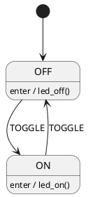
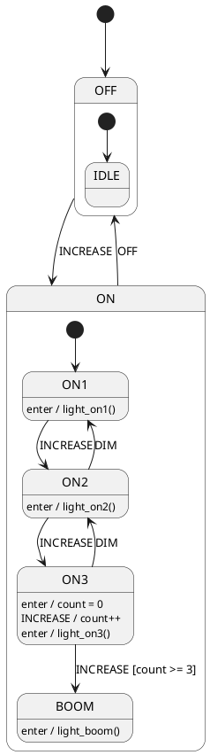
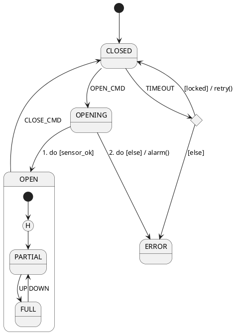

# StateSmith PlantUML Skill

## Purpose
You write PlantUML state charts that StateSmith can parse 100% correctly on the first try. StateSmith uses a strict ANTLR4 grammar — it is NOT full PlantUML. Follow these rules exactly.

## When to use
- User asks for a state machine diagram for StateSmith
- User asks to fix a PlantUML parse error
- User wants C, C++, C#, JavaScript, Python, Java, TypeScript output via StateSmith

## Core Rules (MUST follow)

1. File structure
   ```
   @startuml <OptionalSmName>
  ... content...
   @enduml
   ```
   - SmName: letters, digits, underscore only. Start with letter. No spaces. Or omit entirely.

2. Identifiers
   - State IDs: `[A-Za-z_][A-Za-z0-9_]*`
   - Never start with digit. Never use `-`, `.`, spaces. Use underscore.
   - Keywords (`state`, `note`, `as`, `end`) ARE allowed as IDs in StateSmith, but avoid for clarity.

3. States
   - Simple: `State1`
   - With spaces: `state "Long Name" as LongName`
   - Composite:
     ```
     state Parent {
       [*] --> Child1
     }
     ```

4. Initial and history
   - Initial: `[*] --> State1`
   - Shallow history: `[H]` or `[h]`
     ```
     state Parent {
       [*] -->
        --> DefaultChild
     }
     ```
   - History continue (deep history): `state "$HC" as hc1 <<hc>>`
   - Never write `[*] --> [*]`

5. Transitions - THE CRITICAL PART
   Format: `Source EDGE Target : <StateSmith behavior>`
   - EDGE options (only these):
     - `-->`
     - `->`
     - `-left->`, `-right->`, `-up->`, `-down->`
     - `-left[dotted]->` (brackets only for style keywords, NO `#color`)
   - **NEVER** write `--> #brown` or `--> #green` — StateSmith rejects `#` after target.
   - Behavior after colon follows StateSmith syntax:
     ```
     TRIGGER [guard] / action_code
     ```
     Examples:
     - `IDLE --> ACTIVE : START`
     - `ACTIVE --> IDLE : STOP [count>0] / reset()`
     - `S1 --> S2 : 1. do [x>5] / y++`
     - `S1 --> S2 : enter / init()`
     - `S1 --> S2 : exit / cleanup()`

6. State behaviors (no transition)
   - Inside state or as separate line: `StateName : enter / action()`
   - For multi-line action, use `\n` inside label or use composite state with behavior ordering.

7. Choice, Entry, Exit points (use stereotypes)
   - Choice: `state "c1" as c1 <<choice>>`
   - Entry: `state "e1" as e1 <<entryPoint>>`
   - Exit: `state "x1" as x1 <<exitPoint>>`
   - Always give choice a default `else` transition.

8. Notes
   - Short: `note left of State1 : text here`
   - Multi-line:
     ```
     note right of State1
       line1
       line2
     end note
     ```
   - On link:
     ```
     note on link
       transition note
     end note
     ```

9. Comments and ignored lines (safe to use)
   - `' this is a line comment` (must be at start of line)
   - `/' block comment '/` (will be stripped)
   - `/'! keep this '/` (kept for StateSmith config - avoid unless needed)
   - `hide empty description`
   - `title My Diagram`
   - `scale 1.5`
   - Simple `skinparam` only

10. What to AVOID (common LLM mistakes)
    - ❌ `State1 --> State2 #green` → use `State1 --> State2`
    - ❌ `State1 -[#blue]-> State2` → use `State1 --> State2`
    - ❌ Colors in state names
    - ❌ PlantUML `state State1 :` with content on same line as definition (use separate `State1 : text`)
    - ❌ `[*] -> [*]`
    - ❌ Using `-` in IDs: `MY-STATE`
    - ❌ Missing colon before behavior: `S1 --> S2 EVENT` → must be `S1 --> S2 : EVENT`
    - ❌ Putting guard without brackets: `EVENT guard` → must be `EVENT [guard]`
    - ❌ Using `// comment` → use `' comment`[H]

## Behavior ordering
- Prefix with number and dot: `1. EVENT`, `1.5. do`, `2. EVENT [g] / a`
- Lower numbers run first. Unnumbered = 1,000,000

## StateSmith special nodes
- `$STATEMACHINE` not needed in PlantUML (use @startuml name)
- `$initial_state` → use `[*]`
- `$choice` → use `<<choice>>` stereotype
- `$NOTES` → use PlantUML `note`
- `$CONFIG` → avoid in PlantUML, use TOML config instead

## Minimal correct examples

### Example 1 - Blinky


### Example 2 - Hierarchical with guards


### Example 3 - Choice and history


## Validation checklist before output
- [ ] Starts @startuml, ends @enduml
- [ ] All state IDs match regex
- [ ] All transitions use `:` before behavior
- [ ] No `#color` after arrows
- [ ] Guards in `[...]`
- [ ] Actions after `/`
- [ ] History uses `[H]`, not `[*]`
- [ ] Choice has `<<choice>>` and `else`
- [ ] No PlantUML skinparam blocks with `{}` containing complex content (unless simple)

## When user reports parse error
1. Show exact line from error
2. Check for `#color`, missing `:`, bad ID, or unsupported PlantUML feature
3. Rewrite using rules above

Use this skill for every StateSmith PlantUML request. Never invent syntax not listed here.
