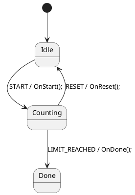
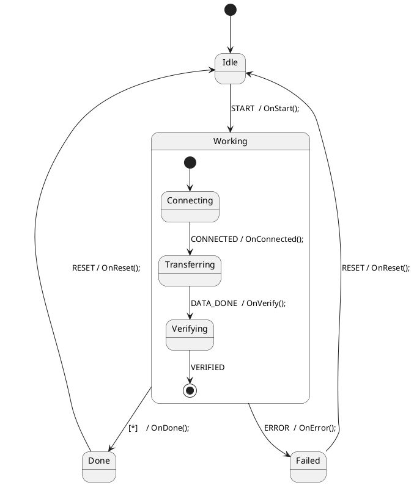
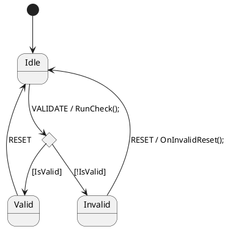

# StateSmith PlantUML Skill (C#)

## Purpose
Generate PlantUML state machines that compile to clean C# via StateSmith for Unity ECS/DOTS. The output is always a `partial struct` (ECS-compatible) unless you explicitly ask for a class.

## Core Architecture

**PlantUML = State Flow Only**
- Defines states, transitions, event names
- Calls methods: `Idle --> Active : START / OnStart();`

**C# Partial Struct = All Logic**
- Implements every method called from PlantUML
- Handles data, calculations, and business rules
- Always `partial struct` + `[Serializable]` (ECS default)
- File: `MySm.partial.cs`

## Required Configuration

```plantuml
/'! $CONFIG : toml
SmRunnerSettings.transpilerId = "CSharp"

[RenderConfig.CSharp]
NameSpace = "MyApp"
Usings = """
using System;
using System.Collections.Generic;
"""
UsePartialClass = true
'/
```

**Options:**
| Option | Example | Notes |
|--------|---------|-------|
| `NameSpace` | `"MyApp.Core"` | No trailing `;` |
| `Usings` | `"""using System;\nusing System.IO;"""` | Injected into generated file |
| `UsePartialClass` | `true` | Always true |
| `BaseList` | `"IDisposable"` | Interfaces/base classes the generated class implements |
| `ClassCode` | `"""public event Action Completed;"""` | Extra declarations injected into the generated class body |

## PlantUML Syntax

### File Structure
```
@startuml Name
/'! $CONFIG : toml ... '/
[*] --> Initial
Initial --> Next : EVENT / Method();
@enduml
```

### Transitions
Format: `Source --> Target : TRIGGER / Action();`

**Triggers:** Uppercase identifiers: `START`, `DONE`, `COMPLETE`, `ERROR`

**Actions:** Single method call: `OnStart();`, `Process();`, `HandleError();`

### Guards (optional)
Format: `Source --> Target : EVENT [flag] / Action();`
- Single variable only: `[isReady]`, `[hasData]`
- No expressions or method calls in guards

### Special Nodes
- Initial: `[*] --> State`
- History: `[H]`
- Choice: `state "c" as c <<choice>>`
- Entry/Exit: `State : enter / OnEnter();` / `State : exit / OnExit();`

## C# Partial Struct Shape

```csharp
namespace MyApp {
using System;

[Serializable]
public partial struct MySm {
    // Fields and action methods ONLY.
    // EventId enum, DispatchEvent, Start, and stateId are already in the generated .cs.
    // Fields must be public — ECS systems read and write them directly.
    public int Count;

    public void OnStart() { ... }
    public void OnProcess() { ... }
}}
```

> **Never redefine** `EventId`, `DispatchEvent()`, `Start()`, or `stateId` — they are generated automatically.
>
> **Class instead of struct:** only use `partial class` if you explicitly need reference semantics and are not targeting ECS.

---

## Examples

### 1. Flat State Machine

The simplest pattern: a linear sequence of states driven by external events.

**Counter.puml**


**Counter.partial.cs**
```csharp
namespace MyApp {
using System;

[Serializable]
public partial struct Counter {
    public int Count;
    public int Limit;

    public void OnStart() {
        Count = 0;
        Limit = 10;
    }

    public void OnReset() {
        Count = 0;
    }

    public void OnDone() {
        Console.WriteLine($"Reached limit: {Count}");
    }

    // Called from your game loop / system; dispatches LIMIT_REACHED when needed
    public void Increment() {
        Count++;
        if (Count >= Limit)
            DispatchEvent(EventId.LIMIT_REACHED);
    }
}}
```

---

### 2. Hierarchical States

Child states inherit transitions from their parent. Useful for shared error handling or shared cancel behaviour.

**Download.puml**


**Download.partial.cs**
```csharp
namespace MyApp {
using System;

[Serializable]
public partial struct Download {
    public FixedString128Bytes Url;
    public int BytesReceived;

    public void OnStart()     { /* begin connection */ }
    public void OnConnected() { /* begin transfer */ }
    public void OnVerify()    { /* verify checksum */ }
    public void OnDone()      { /* finalize */ }
    public void OnError()     { BytesReceived = 0; }
    public void OnReset()     { BytesReceived = 0; }
}}
```

---

### 3. Choice Node

Use a choice pseudo-state when a transition branches on data that can only be evaluated at runtime.

**Validator.puml**


**Validator.partial.cs**
```csharp
namespace MyApp {
using System;

[Serializable]
public partial struct Validator {
    public bool IsValid;        // guard variable read directly by the state machine
    public FixedString64Bytes Input;

    public void RunCheck() {
        IsValid = Input.Length >= 3;
    }

    public void OnInvalidReset() {
        Input = default;
    }
}}
```

> **Guard variable naming:** the field name in the partial struct must exactly match the identifier inside `[brackets]` in the PlantUML. Since fields are now public PascalCase, use `[IsValid]` in the diagram to match `public bool IsValid`.

---

## Struct Conversion (ECS/DOTS) — Default

StateSmith always generates `partial class`, but the target is always `partial struct` for Unity ECS. The conversion is a required step in every workflow — not optional.

### Why struct works

C# instance methods on structs receive `this` by reference. The generated `DispatchEvent()`, `Start()`, and all state handlers that mutate `this.stateId` behave identically to the class version.

### Step 1 — Write your partial as a struct from the start

Always write `[Serializable] public partial struct` in your `.partial.cs`. Do not write `partial class` and convert later.

```csharp
[Serializable]
public partial struct Counter { ... }
```

### Step 2 — Generate, then patch

```bash
# Generate the .cs (produces partial class)
DOTNET_ROOT=/usr/lib/dotnet DOTNET_ROLL_FORWARD=LatestMajor ss.cli run -h

# Patch it to partial struct
ss-to-struct.sh Counter.cs
```

**What `ss-to-struct.sh` does:**
1. `public partial class Name` → `public partial struct Name`
2. Removes the parameterless constructor (structs have an implicit one)

> **Note:** The script does **not** create a backup. Commit to version control before running it.

### Step 3 — Implement `IComponentData`

```csharp
[Serializable]
public partial struct Counter : IComponentData { ... }
```

---

## Workflow

1. Design states and transitions in PlantUML
2. Write `.partial.cs` with `[Serializable] public partial struct` — always struct from the start
3. Run `ss.cli run -h` to generate the `.cs` — **do this before finalising the partial**
4. Read the generated `.cs` to confirm the exact struct name, `EventId` values, and method signatures
5. Run `ss-to-struct.sh Generated.cs` to patch the generated file from `partial class` → `partial struct`
6. Add `IComponentData` to the partial struct and compile

```bash
DOTNET_ROOT=/usr/lib/dotnet DOTNET_ROLL_FORWARD=LatestMajor ss.cli run -h
ss-to-struct.sh MyName.cs
```

---

## ⚠ Critical Pitfalls

### 1. `ss.cli run -h` generates code — it is not a help flag
`-h` means "here" (run in current directory). It reads your `.puml` and writes the `.cs`. Run it first so you know what was actually generated before writing the partial class.

### 2. Struct name comes from `@startuml`, not the filename
`@startuml Counter` → generates `Counter.cs` with `public partial class Counter` (patched to `struct` by the script).
Your partial file must be `Counter.partial.cs` with `public partial struct Counter`.
Do not invent a suffix like `CounterSm`.

### 3. Never redefine generated members in the partial class
The generated `.cs` already contains:
- `public enum EventId { ... }`
- `public void DispatchEvent(EventId eventId)`
- `public StateId stateId`
- `public void Start()`

Defining any of these again causes a compile error.

### 4. Nested `DispatchEvent` during a transition is a no-op
Calling `DispatchEvent()` inside an action method (which runs mid-transition) does nothing — the state machine ignores nested dispatches. Dispatch the next event externally after the current one completes.

### 5. .NET version compatibility
`ss.cli` targets .NET 9. If your system has .NET 10+, set the rollforward flag or you will get a "you must install .NET" error even though .NET is present:

```bash
DOTNET_ROOT=/usr/lib/dotnet DOTNET_ROLL_FORWARD=LatestMajor ss.cli run -h
```
