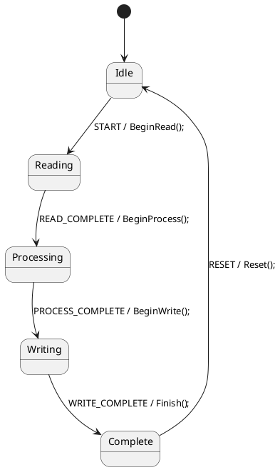

# StateSmith PlantUML Skill (C#)

## Purpose
Generate PlantUML state machines that compile to clean C# via StateSmith for any C# target (.NET, Unity, console, services).

## Core Architecture

**PlantUML = State Flow Only**
- Defines states, transitions, event names
- Calls methods: `Idle --> Active : START / OnStart();`

**C# Partial Class = All Logic**
- Implements every method called from PlantUML
- Handles data structures, calculations, I/O, business rules
- File: `MySm.partial.cs`

## Required Configuration

```plantuml
/'! $CONFIG : toml
SmRunnerSettings.transpilerId = "CSharp"

[RenderConfig.CSharp]
NameSpace = "MyApp"
Usings = """
using System;
using System.Collections.Generic;
"""
UsePartialClass = true
'/
```

**Options:**
- `NameSpace` - Your namespace (no trailing `;`)
- `Usings` - Namespaces for your partial class
- `UsePartialClass` - Always true

## PlantUML Syntax

### File Structure
```
@startuml Name
/'! $CONFIG : toml ... '/
[*] --> Initial
Initial --> Next : EVENT / Method();
@enduml
```

### Transitions
Format: `Source --> Target : TRIGGER / Action();`

**Triggers:** Uppercase identifiers: `START`, `DONE`, `COMPLETE`, `ERROR`

**Actions:** Single method call: `OnStart();`, `Process();`, `HandleError();`

### Guards (optional)
Format: `Source --> Target : EVENT [flag] / Action();`
- Single variable only: `[isReady]`, `[hasData]`
- No expressions or method calls

### Special Nodes
- Initial: `[*] --> State`
- History: `[H]`
- Choice: `state "c" as c <<choice>>`
- Entry: `State : enter / OnEnter();`

## C# Implementation

**Partial class:**
```csharp
namespace MyApp {
using System;
using System.Collections.Generic;

public partial class MySm {
    // ONLY data fields and action methods here.
    // EventId enum and DispatchEvent are already in the generated .cs
    private Dictionary<string, float> _data;
    private int _count;
    
    public void OnStart() {
        Console.WriteLine("Starting");
        _data = new Dictionary<string, float>();
    }
    
    public void Process() {
        foreach(var item in _data) {
            // Process
        }
    }
}}
```

> **Note:** `EventId` and `DispatchEvent()` are generated automatically. Do NOT redefine them.

## Complete Example

**DataProcessor.puml:**


**DataProcessorSm.partial.cs:**
```csharp
namespace MyApp.Processing {
using System;
using System.Collections.Generic;

public partial class DataProcessor {
    // NO EventId enum — already generated in DataProcessor.cs
    // NO DispatchEvent — already generated in DataProcessor.cs
    
    private Dictionary<string, float> _inputData;
    private Dictionary<string, float> _outputData;
    private float _total;
    
    public void BeginRead() {
        _inputData = new Dictionary<string, float> {
            {"Item1", 10f},
            {"Item2", 15f},
            {"Item3", 12f}
        };
        Console.WriteLine($"Reading {_inputData.Count} items");
        // Caller dispatches READ_COMPLETE externally
    }
    
    public void BeginProcess() {
        _outputData = new Dictionary<string, float>();
        _total = 0f;
        
        foreach(var kvp in _inputData) {
            float processed = ProcessValue(kvp.Value);
            _outputData[kvp.Key] = processed;
            _total += processed;
        }
        Console.WriteLine($"Processed total: {_total}");
        // Caller dispatches PROCESS_COMPLETE externally
    }
    
    public void BeginWrite() {
        Console.WriteLine("Writing results");
        // Caller dispatches WRITE_COMPLETE externally
    }
    
    public void Finish() {
        Console.WriteLine("Processing complete");
    }
    
    public void Reset() {
        _inputData?.Clear();
        _outputData?.Clear();
        _total = 0f;
    }
    
    private float ProcessValue(float input) {
        return input * 1.5f;
    }
}
```

## Reference

### RenderConfig.CSharp
| Option | Example |
|--------|---------|
| NameSpace | `"MyApp.Core"` |
| Usings | `"""using System;\nusing System.IO;"""` |
| BaseList | `"IDisposable"` |
| ClassCode | `"""public event Action Completed;"""` |
| UsePartialClass | `true` |

### State Patterns
- **Simple:** `A --> B : EVENT / Action();`
- **Hierarchical:** `state Parent { [*] --> Child }`
- **Choice:** `state c <<choice>>` then `c --> A : [cond]`
- **History:** `[H] --> DefaultState`

## Rules

1. PlantUML actions are method calls only: `DoWork();`
2. No square brackets in actions: move `dict[key]` to C# method
3. Guards are single variables: `[ready]` not `[x > 5]`
4. All business logic lives in partial class methods

## Workflow

1. Design states and transitions in PlantUML
2. Implement all methods in `.partial.cs`
3. Run: `DOTNET_ROOT=/usr/lib/dotnet DOTNET_ROLL_FORWARD=LatestMajor ss.cli run -h` to generate the `.cs` from the `.puml`
4. **Read the generated `.cs` file** before writing or fixing the partial class — it tells you the exact class name, enum names, and method signatures you must match
5. Use generated class + partial class together

## Struct Conversion (ECS/DOTS)

StateSmith generates `partial class` but Unity ECS requires `partial struct` for `Data`. SO ALWAYS CONVERT. Use the included script:

```bash
# After ss.cli generates the .cs file:
ss-to-struct.sh path/to/Generated.cs
```

**What it does:**
1. `public partial class Name` → `public partial struct Name`
2. Removes the parameterless constructor (structs have implicit one)
3. Saves a `.bak` backup

**You must ALSO change your `.partial.cs` file:**
```csharp
// Before:
public partial class Adder { ... }

// After:
public partial struct Adder { ... }
```

**Structs work because:** Instance methods on structs receive `this` by reference in C#. The generated `DispatchEvent()`, `Start()`, and all `private void` handlers that mutate `this.stateId` work correctly — mutations are visible to the caller.

**Workflow for ECS:**
1. Create `.puml` + `.partial.cs` (using `partial struct`)
2. Run `ss.cli run -h` to generate `.cs` (produces `partial class`)
3. Run `ss-to-struct.sh Generated.cs` to convert to `partial struct`
4. Implement `IComponentData` in your partial struct
5. Compile and use as an ECS component

## ⚠ Critical Pitfalls

### 1. Run `ss.cli run -h` FIRST — It Generates Code, Not Help
`ss.cli run -h` is NOT a help command. It reads your `.puml` and generates the `.cs` file. The `-h` flag means "here" (run in current context). Always run it before writing the partial class so you can see what was actually generated.

### 2. Class Name Comes From `@startuml`
The generated class name equals the `@startuml Name` identifier. **NOT** `NameSm` or `NameSm.partial.cs`.
- `@startuml Adder` → generates class `Adder` in `Adder.cs`
- The partial class file must be `Adder.partial.cs` with `public partial class Adder`
- Do NOT invent a different name like `AdderSm`

### 3. The Generated Code Already Defines EventId and DispatchEvent
The auto-generated `.cs` file includes:
- `public enum EventId { ADD = 0, COMPLETE = 1, ... }`
- `public void DispatchEvent(EventId eventId)` with full state machine logic
- `public StateId stateId`
- `public void Start()`

**Do NOT duplicate these in your partial class.** Your partial class only needs:
- Fields/data
- The action methods called from PlantUML transitions (e.g., `OnAdd()`, `OnComplete()`)
- Helper methods

### 4. Nested DispatchEvent During Transitions Is a No-Op
Calling `DispatchEvent()` inside a transition action handler (e.g., calling `DispatchEvent(COMPLETE)` inside `OnAdd()`) does nothing — you're mid-transition and the state machine ignores nested dispatches. For auto-advancing chains, dispatch the next event externally or use a different pattern.

### 5. .NET Version Compatibility
`ss.cli` targets .NET 9. If the system has .NET 10+, you must set:
```bash
DOTNET_ROOT=/usr/lib/dotnet DOTNET_ROLL_FORWARD=LatestMajor ss.cli run -h
```
Without `DOTNET_ROLL_FORWARD=LatestMajor`, it will fail with "you must install .NET" even though .NET is present.
