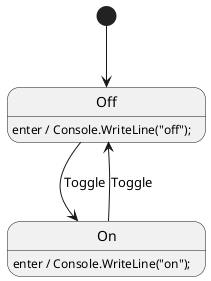
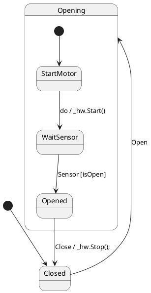

# StateSmith PlantUML Skill — C# Complete Reference

## Purpose
You generate PlantUML state machines that compile to idiomatic, production-ready C# with StateSmith. You know the strict ANTLR grammar AND every C# option that can be set inside the diagram itself.

Use this skill when the user wants C#,.NET, Unity, or any C# transpilation.

---

## 1. The Required C# Config Block

**ALWAYS start every diagram with this kept-comment block.** StateSmith reads it automatically.

```plantuml
/'! $CONFIG : toml
SmRunnerSettings.transpilerId = "CSharp"
SmRunnerSettings.algorithmId = "Balanced2" # or "Minimal"

[RenderConfig.CSharp]
NameSpace = "MyApp.StateMachines;" # the trailing ; = file-scoped namespace (C#10+)
Usings = """
using System;
using System.Threading.Tasks;
"""
UsePartialClass = true # default true - KEEP IT
UseNullable = true # default true - KEEP IT
BaseList = "" # e.g. "IDisposable, IStateMachine"
ClassCode = "" # raw C# injected into class

[RenderConfig]
AutoExpandedVars = """
private readonly ILogger _logger;
"""
'/
```

**Syntax rules:**
- Starts with `/'! $CONFIG : toml` exactly
- Ends with `'/` on its own line
- TOML inside — no PlantUML here


## 2. Full C# RenderConfig Reference

  Option              | Type             | Default | What it does                          | Example                                  |
 |---------------------|------------------|---------|---------------------------------------|------------------------------------------|
 | **NameSpace**       | string           | ""      | File-scoped namespace. Add `;` at end. | `"Game.Core;"`                           |
 | **Usings**          | multiline string | ""      | Namespaces at top of file             | `"""using System;\nusing MediatR;"""`    |
 | **BaseList**        | string           | ""      | Inherit or implement                  | `"StateMachineBase, IDisposable"`        |
 | **UsePartialClass** | bool             | true    | Generates `public partial class`. Required for DI. | `true`  |
 | **UseNullable**     | bool             | true    | Enables `#nullable enable`            | `true`                                   |
 | **ClassCode**       | multiline string | ""      | Injects raw C# members into generated class | `"""public event Action? OnError;"""`    |
 | **FileHeader**      | string           | ""      | Comment at top of .cs file             | `"// Generated by StateSmith"`           |
 | **ClassName**       | string           | auto    | Override generated class name         | `"DoorControllerSm"`                     |

### General RenderConfig (works for all languages, critical for C#)

| Option | Purpose | Example |
| --- | --- | --- |
| **AutoExpandedVars** | Declares private fields AND creates expansions automatically | `"""private int _count;\nprivate readonly IService _svc;"""` |
| **DefaultVarExpTemplate** | Turns any unknown identifier into C# code | `"this.{AutoNameCopy()}"` |
| **VariableDeclarations** | Legacy way to declare vars (prefer AutoExpandedVars) | `"_count : int = 0"` |

---

## 3. C# Patterns You Can Do Entirely in PlantUML

### A. Dependency Injection (no.csx needed)
```toml
[RenderConfig]
AutoExpandedVars = """
private readonly IAudioPlayer _player;
private readonly GameConfig _config;
"""
```
In diagram: `IDLE : enter / _player.Stop();`

Then create a partial file yourself:
```csharp
// MySm.partial.cs
namespace MyApp.StateMachines;
public partial class MySm {
    public MySm(IAudioPlayer player, GameConfig config) {
        _player = player;
        _config = config;
    }
}
```

### B. Add Methods and Events
```toml
[RenderConfig.CSharp]
ClassCode = """
public event Action<string>? StateChanged;

protected override void OnStateChanged() {
    StateChanged?.Invoke(CurrentStateId);
}

public void Reset() => Initialize();
"""
```

### C. Implement an Interface
```toml
BaseList = "IAsyncDisposable"
ClassCode = """
public ValueTask DisposeAsync() {
    // cleanup
    return ValueTask.CompletedTask;
}
"""
```

### D. File-scoped Namespace + Usings
```toml
NameSpace = "Company.Product.Features;"
Usings = """
using System.Diagnostics;
using Microsoft.Extensions.Logging;
"""
```
Generates:
```csharp
namespace Company.Product.Features;

using System.Diagnostics;
//...
public partial class MySm { }
```

---

## 4. PlantUML Grammar Rules for StateSmith (C# Safe)

1. **File**
   `
   @startuml OptionalName
  ...config block...
   [*] --> State
   @enduml
   `

2. **Identifiers**: `[A-Za-z_][A-Za-z0-9_]*` only. For spaces: `state "Door Open" as DoorOpen`

3. **Transitions** (critical):
   ```
   Source --> Target : TRIGGER [guard] / CSharpCode();
   ```
   - Valid edges: `-->`, `->`, `-left->`, `-right->`, `-up->`, `-down->`, `-left[dotted]->`
   - **NEVER**: `--> #red`, `-[#blue]->`, `--> State #green`

4. **State actions**:
   ```
   StateName : enter / _logger.LogInformation("enter");
   StateName : exit / Cleanup();
   StateName : 1. TIMER [x>5] / _count++;
   ```

5. **Special nodes**:
   - Initial: `[*] --> Idle`
   - History: `[H]` shallow, `state "$HC" as hc <<hc>>` for deep
   - Choice: `state "c" as c <<choice>>` then `c --> A : [ok]` and `c --> B : [else]`
   - Entry/Exit: `<<entryPoint>>`, `<<exitPoint>>`

---

## 5. Ready-to-Paste C# Snippets

### Full production config
```plantuml
/'! $CONFIG : toml
SmRunnerSettings.transpilerId = "CSharp"

[RenderConfig.CSharp]
NameSpace = "App.SM;"
Usings = """
using Microsoft.Extensions.Logging;
"""
UsePartialClass = true
UseNullable = true
BaseList = "IDisposable"
ClassCode = """
public void Dispose() { }
"""

[RenderConfig]
AutoExpandedVars = """
private readonly ILogger _log;
"""
DefaultVarExpTemplate = "this.{AutoNameCopy()}"
'/
```

### Unity-specific
```toml
[RenderConfig.CSharp]
NameSpace = "Game;"
Usings = """
using UnityEngine;
"""
BaseList = "MonoBehaviour"
ClassCode = """
void Update() { DispatchEvent(EventId.TICK); }
"""
```

---

## 6. Minimal C# Examples (use these patterns)

### Example A — Simple


### Example B — Hierarchical with DI


---

## 7. C# Troubleshooting Checklist

- [ ] Config block uses `/'!` and closes with `'/`
- [ ] `transpilerId = "CSharp"` is set
- [ ] `NameSpace` ends with `;` for file-scoped
- [ ] `UsePartialClass = true` (otherwise you cannot inject constructor)
- [ ] All fields used in actions are in `AutoExpandedVars`
- [ ] No `#color` on transitions
- [ ] Every transition has `:` before behavior
- [ ] Guards use `[ ]`, actions use `/` and end with `;`
- [ ] Build command: `StateSmith.Cli` generates `.cs` with 0 errors

Never invent PlantUML features. Only use syntax listed in sections 1-4.
```
